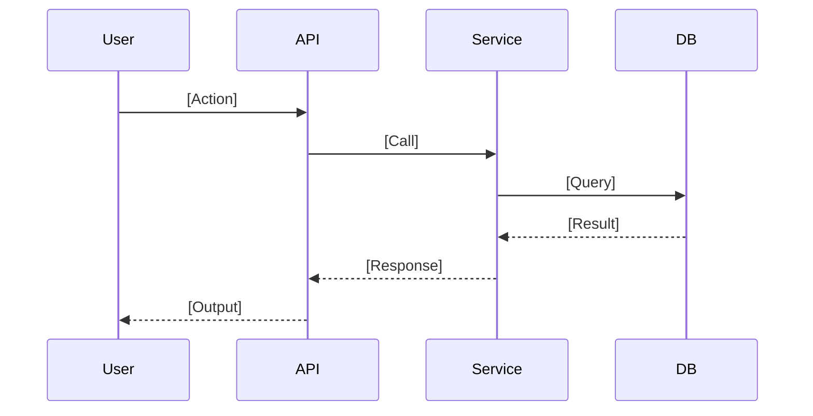

# Feature Design: [Feature Name]

> **Drafted by:** Architect Agent
> **Approved by:** Intent Leg — [name] on YYYY-MM-DD
> **Status:** `Draft` | `Approved` | `Superseded`
> **Linked spec:** `specs/[feature-name]/requirements.md`

> ⚠️ **Implementation does not begin until this document is approved by the Intent Leg.** The Developer Agent reads this file as its primary implementation contract alongside `requirements.md`.

---

## Architectural Summary

[2–4 sentences. What is the high-level approach? What architectural patterns are being applied? What are the key design decisions?]

---

## Compliance Check

| Engineering standard | This design complies? | Notes |
|---|---|---|
| Tech stack (`foundations/engineering.md`) | `✓ Yes` \| `✗ No — [reason]` | |
| Security patterns | `✓ Yes` \| `✗ No — [reason]` | |
| Testing standards | `✓ Yes` \| `✗ No — [reason]` | |
| Performance targets | `✓ Yes` \| `✗ No — [reason]` | |
| Compliance requirements (`foundations/product.md`) | `✓ Yes` \| `✗ No — [reason]` | |

> **Architect Agent declaration:** This design has been validated against `foundations/engineering.md` v[X.X] and `foundations/product.md` v[X.X]. All deviations are documented below under Architectural Decisions.

---

## Component Design

### New Components

| Component | Type | Responsibility | Dependencies |
|---|---|---|---|
| `[ComponentName]` | `Service` \| `Model` \| `Controller` \| `Repository` \| `Util` | [Single clear responsibility] | [What it depends on] |

### Modified Components

| Component | Current behaviour | Change required | Risk |
|---|---|---|---|
| `[ComponentName]` | [What it does now] | [What changes and why] | `Low` \| `Medium` \| `High` |

### Unchanged Components

[List any adjacent components the Developer Agent might be tempted to touch — explicitly declare them out of scope for this implementation.]

---

## Data Design

### New Data Structures

```
[Entity/Model name]
├── [field]: [type] — [constraints, e.g., required, max 255 chars, unique]
├── [field]: [type] — [constraints]
└── [field]: [type] — [constraints, e.g., FK to Entity.id, cascade delete]
```

### Schema Migrations

| Migration | Type | Reversible? | Risk |
|---|---|---|---|
| [e.g., Add `status` column to `orders`] | `additive` \| `destructive` | `Yes` \| `No` | `Low` \| `Medium` \| `High` |

> **Destructive migrations require explicit Intent Leg approval before execution.**

---

## API Design

### New Endpoints

```
[METHOD] /[path]
  Auth: [required/optional/none] — [mechanism]
  Request:
    [field]: [type] — [required/optional], [constraints]
  Response (200):
    [field]: [type] — [description]
  Errors:
    400 — [condition that produces this]
    401 — [condition]
    404 — [condition]
    422 — [condition]
```

### Modified Endpoints

| Endpoint | Change | Backwards compatible? |
|---|---|---|
| `[METHOD] /[path]` | [Description of change] | `Yes` \| `No — breaking change` |

> **Breaking API changes require a version bump strategy documented here.**

---

## Sequence Diagrams

> Include sequence diagrams for non-trivial flows. Use text-based diagrams (Mermaid) for version-control friendliness.



---

## Error Handling Strategy

| Error condition | Handling approach | User-facing message | Logged? |
|---|---|---|---|
| [Condition] | [How the code handles it] | [What the user sees] | `Yes` \| `No` |

---

## Test Strategy

> The Reviewer Agent will validate tests against BDD scenarios in `requirements.md`. Document how the design supports testability.

| Test type | Scope | Key scenarios to cover |
|---|---|---|
| Unit | [Components] | [Which BDD scenarios map to unit tests] |
| Integration | [Boundaries] | [Which BDD scenarios require integration tests] |
| Contract | [API surface] | [Which endpoints need contract tests] |

**Test doubles / mocks required:** [List any external dependencies that need mocking]

---

## Architectural Decisions

> Document every deviation from `foundations/engineering.md` or any significant design choice that future engineers need to understand.

### ADR-001: [Decision title]

- **Context**: [Why was this decision needed?]
- **Decision**: [What was decided?]
- **Alternatives considered**: [What else was evaluated?]
- **Consequences**: [What are the trade-offs?]
- **Approved by**: [Intent Leg sign-off]

---

## Implementation Notes for Developer Agent

> Specific guidance to reduce ambiguity during implementation. The Developer Agent reads this section first after `tasks.md`.

- [Note 1 — e.g., Use the existing `BaseRepository` pattern; do not create a new abstraction]
- [Note 2 — e.g., The `status` field is an enum; add new values to the existing `OrderStatus` enum, do not create a parallel type]
- [Note 3 — e.g., All new endpoints must go through the existing `AuthMiddleware`; do not bypass]

---

*Template version: 1.0 — InsightForge SDD*
